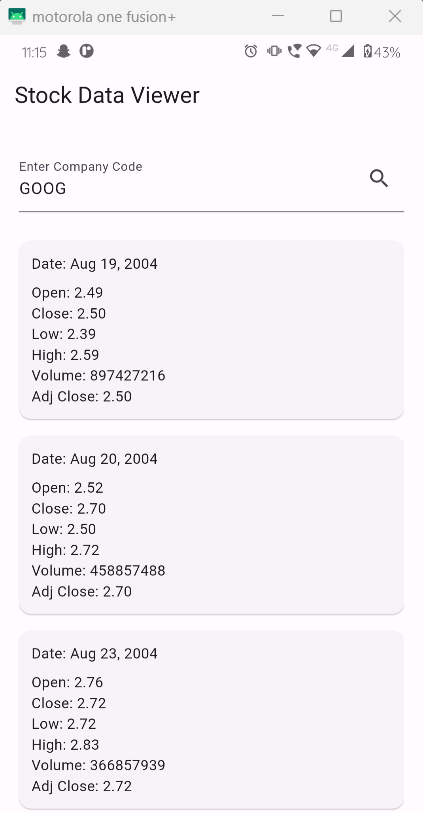

# Yahoo Finance APP

A new Flutter project with REST API Integration

## Getting Started

The Yahoo Finance API provided access to financial data such as stock quotes, historical prices, and market trends, enabling developers to retrieve comprehensive information for analysis and integration into applications. 

Inorder to run the application download the code into local machine having flutter and dart installed and type "flutter run"

Also inorder to view details of a particular company, the companies code that is in Yahoo finance should be typed on the search bar in app

## 2. ScreenShot

  

## 3. References
Inorder to understand and for the usage of API, https://pub.dev/packages/yahoo_finance_data_reader was used as a reference
